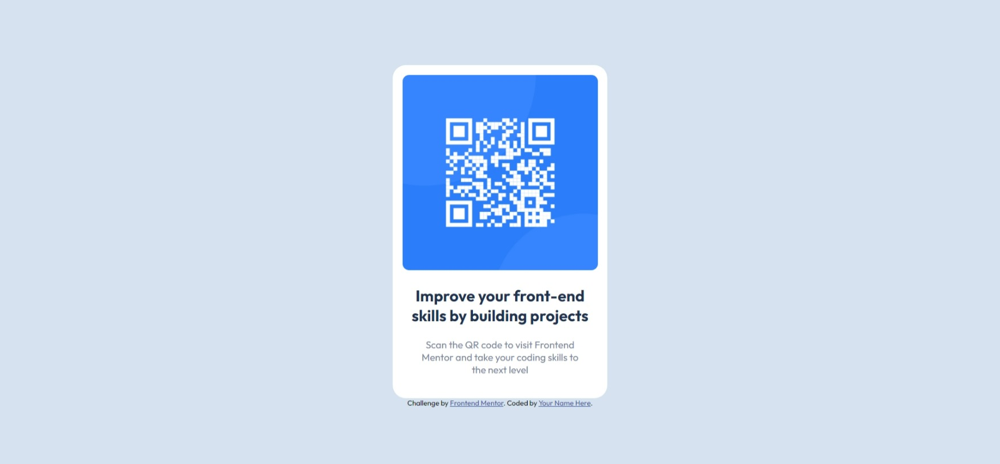

# Frontend Mentor - QR code component solution

This is a solution to the [QR code component challenge on Frontend Mentor](https://www.frontendmentor.io/challenges/qr-code-component-iux_sIO_H). Frontend Mentor challenges help you improve your coding skills by building realistic projects. 

## Table of contents

- [Overview](#overview)
  - [Screenshot](#screenshot)
  - [Links](#links)
- [My process](#my-process)
  - [What I learned](#what-i-learned)
  - [Useful resources](#useful-resources)
- [Author](#author)
- [Acknowledgments](#acknowledgments)

**Note: Delete this note and update the table of contents based on what sections you keep.**

## Overview

### Screenshot



### Links

- Solution URL: [https://github.com/Arnav-Ghatti/QR-Code](https://github.com/Arnav-Ghatti/QR-Code)
- Live Site URL: [https://arnav-ghatti.github.io/QR-Code/](https://arnav-ghatti.github.io/QR-Code/)

**Note: These are just examples. Delete this note and replace the list above with your own choices**

## My Process

### What I learned

To see how you can add code snippets, see below:
```css
.card {
  box-shadow: 0px 0px 20 10px #7b879d;
}
```

### Useful resources

- [Box Shadow by W3Schools](https://www.w3schools.com/css/css3_shadows_box.asp#:~:text=%20CSS%20Box%20Shadow%20%201%20CSS%20box-shadow,The%20spread%20parameter%20defines%20the%20spread...%20More%20) - Helped me add a subtle box shadow to the main component

## Author

- Frontend Mentor - [@Arnav-Ghatti](https://www.frontendmentor.io/profile/Arnav-Ghatti)

## Acknowledgments

This was my first time working with git. I followed the guide by CodeWithHarry on youtube.

HAD FUN :)
